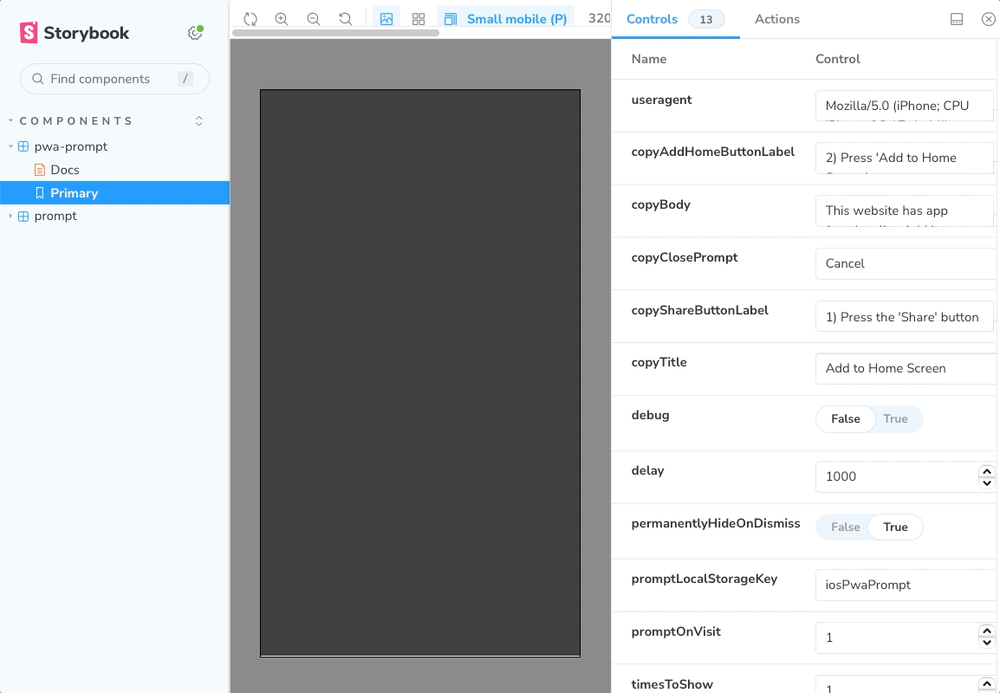

# react-ios-pwa-prompt-ts

Forked with care from [react-ios-pwa-prompt](https://github.com/chrisdancee/react-ios-pwa-prompt), this package is revamped using Vite, Styled Components, and TypeScript.

## Summary

> Enhancing PWAs for iOS

See the interactive [Storybook Demo!](https://thenick775.github.io/react-ios-pwa-prompt-ts/)

A React component that provides a customizable Progressive Web App (PWA) prompt telling the user to 'Add to Home Screen'. The prompt behavior is baked in to Android devices, yet iOS is still lagging behind. This component aims to provide a simple way to provide this functionality on iOS for websites that are PWA-ready. The prompt styles closely match iOS designs for both light and dark UI modes to appear native to the user.



## Features

- 🛠 Fully configurable:
  - Set the frequency and conditions for displaying the prompt.
  - All components and hooks are [exported](./lib/main.ts) for full customization and composition.
- 📃 Customize prompt content based on PWA availability and full-screen mode.
- ⚡️ Efficient: Minimal overhead for non-iOS devices, optimizing each page load.
- 🌕 Dark mode support: Adapts to iOS 13 and 14 settings.
- 🎨 Supports custom styling with `styled-components`

## Usage

1. Add `react-ios-pwa-prompt-ts` as a dependency:

```
npm i react-ios-pwa-prompt-ts
```

2. Add peer dependencies if not already included in your application:

```
npm i react styled-components
```

3. Import into your project:

```
import { PwaPrompt } from 'react-ios-pwa-prompt-ts'
```

4. Render the component:

```
<PwaPrompt />
```

5. Optional configuration props:

| Name                       | Description                                                                                                   | Default Value                                                                                               |
| -------------------------- | ------------------------------------------------------------------------------------------------------------- | ----------------------------------------------------------------------------------------------------------- |
| `className`                | Add a custom class name to the prompt component, for use with `styled-components`.                            |                                                                                                             |
| `copyAddHomeButtonLabel`   | Pass a string to customize label of add to home instruction.                                                  | `2) Press 'Add to Home Screen'`                                                                             |
| `copyBody`                 | Pass a string to customize the body of the prompt.                                                            | `This website has app functionality. Add it to your home screen to use it in fullscreen and while offline.` |
| `copyClosePrompt`          | Pass a string to customize label of close button.                                                             | `Cancel`                                                                                                    |
| `copyShareButtonLabel`     | Pass a string to customize label of share button.                                                             | `1) Press the 'Share' button`                                                                               |
| `copyTitle`                | Pass a string to customize the title of the prompt.                                                           | `Add to Home Screen`                                                                                        |
| `delay`                    | Pass an integer in ms to add a delay to the prompt.                                                           | `1000`                                                                                                      |
| `isOpen`                   | Pass a boolean to control when the prompt displays, for use when using this prompt as a controlled component. | `undefined`                                                                                                 |
| `onClose`                  | Pass a function to call upon closing the prompt. Passes the event object as the function argument.            | `undefined`                                                                                                 |
| `permanentlyHideOnDismiss` | Pass a boolean to configure whether to never show the prompt again once dismissed.                            | `true`                                                                                                      |
| `promptLocalStorageKey`    | Provide a custom key for storing prompt data in local storage.                                                | `iosPwaPrompt`                                                                                              |
| `promptOnVisit`            | Pass an integer for the when to start showing the prompt.                                                     | `1`                                                                                                         |
| `skipStorageUpdate`        | Allows for manual control over the prompt automatically updating storage.                                     | `undefined`                                                                                                 |
| `timesToShow`              | Pass an integer to configure how many times to show the prompt.                                               | `1`                                                                                                         |
| `transitionDuration`       | Pass an integer in ms to control the duration of the prompt transition in and out of the viewport.            | `400`                                                                                                       |

See the interactive [Storybook Demo](https://thenick775.github.io/react-ios-pwa-prompt-ts/) for further information.

## Storybook

Storybook is a development environment for UI components. Follow the steps below to run the Storybook demo for this project:

1. Clone this repository to your machine, and install project dependencies by running the following command in your project directory:

```
npm install
```

2. Once the installation is complete, run the following command to start Storybook:

```
npm run storybook
```

3. Open your web browser and go to http://localhost:6006 to view the interactive Storybook demo.

You can now explore stories, view docs, make changes to the components, and see the live updates in Storybook!

## Rollup Visualizer

To view the size of this package and its dependencies, run the following command:

```
npm run stats
```

## Contributing

Feel free to open discussions, issues, and pull requests. Contributions are welcome!
